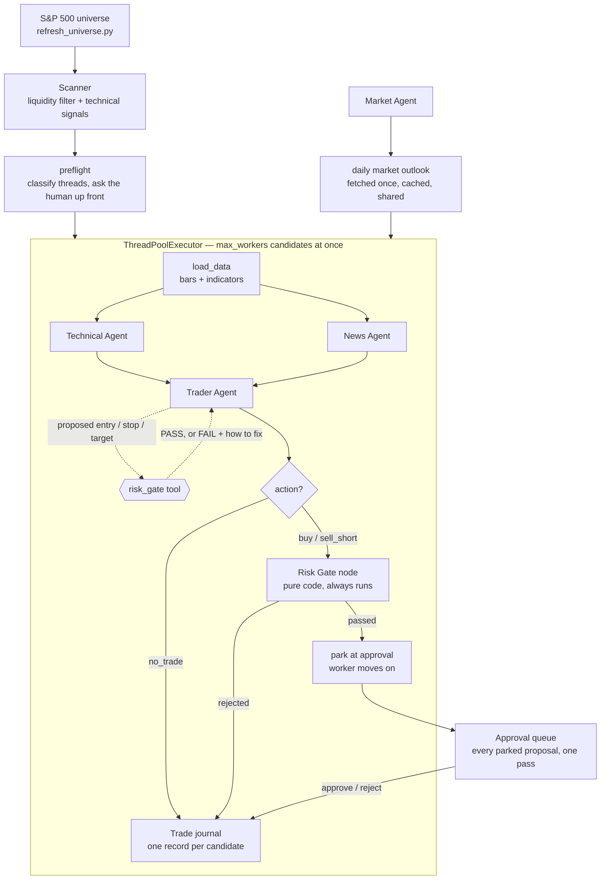

# Agentic Trading Desk

A multi-agent swing-trading assistant for US equities with a human in the loop. A deterministic scanner screens the S&P 500 for candidate setups; two specialist LLM agents (technical, news) analyze each candidate in parallel against a shared daily market outlook; a trader agent synthesizes their views and proposes a trade — or explicitly declines. Every proposal passes a code-level risk gate the LLM cannot override, then pauses for human approval before anything executes.

**Status: in active development.** Paper/simulated trading only — no real money is ever at risk.

## How it works

Candidates are analyzed concurrently in a thread pool. Each one runs its own graph with its own checkpoint, so a run that dies mid-way resumes where it stopped instead of starting over. Analysis never blocks on a human: a candidate that reaches the approval step parks there and the worker moves on, so every proposal is reviewed together at the end.



**The risk gate runs twice, on purpose.** The trader agent holds it as a *tool*: it proposes prices, gets back `PASS` or a `FAIL` explaining what to fix, and adjusts before committing to an answer. That makes the proposal likely to be valid. It does not make it trusted — the same code then runs again as a graph node the agent has no control over. The tool is a drafting aid; the node is the enforcement.

Every candidate produces exactly one journal record: `no_trade`, `human_approved`, `human_rejected`, or `failed`. An API error is never recorded as a trading decision.

## Design principles

- **Hard risk limits live in code, not prompts.** The LLM cannot override the gate; the human approves within it.
- **NO-TRADE is a first-class decision.** Most days, standing aside is correct — the agent says so, with reasoning.
- **Cheap filters run wide, expensive analysis runs narrow.** Deterministic scanner over 500 names; LLM pipeline over the top handful.
- **Process over P&L.** A few days of returns is statistical noise; the eval suite measures groundedness, policy compliance, and safety invariants instead.

## Build status

- [x] Universe refresh script (`src/refresh_universe.py`) — pulls S&P 500 constituents from Wikipedia; output CSV is generated locally, not committed
- [x] Technical indicators — RSI (Wilder), SMA/crossovers, volume spike, 52-week high/low (pure pandas)
- [x] Scanner — two-stage screen over daily bars
- [x] Specialist agents — technical / news, plus a shared daily market outlook
- [x] Trader agent — outlook synthesis + structured proposals
- [x] Risk gate + human-in-the-loop approval
- [x] Execution layer (MCP server → trade journal; Alpaca paper API later) (Skip)
- [x] Resume logic — detect and resume pending approvals from existing threads
- [x] Rate-limit handling — shared rate limiter, retry that resumes from the checkpoint
- [x] Parallel execution — concurrent specialists and concurrent candidate analysis
- [x] Approval queue — batch review of pending proposals after parallel runs
- [x] Orchestration tests — routing, retry, and logging contract (pytest, no network)
- [x] Structured logging — per-symbol attribution for concurrent runs
- [ ] Eval suite — safety invariants, LLM-as-judge process scoring, frozen-snapshot regression set
- [x] LangSmith tracing + session persistence
- [ ] Dockerize (post-core-build)

## Tech stack

Python · LangGraph / LangChain · OpenAI · Alpaca Market Data API (daily bars) · Tavily (news search) · pytest

## Setup

```bash
git clone "https://github.com/mananpatelll/Agentic-Trading.git"
cd Agentic-Trading
python -m venv venv && source venv/bin/activate   # Windows: venv\Scripts\activate
pip install -r requirements.txt
cp .env.example .env    # add your keys
```

Generate the trading universe — **required once before the first scan**, and re-run occasionally as index membership changes:

```bash
python src/refresh_universe.py
```

Then scan, and run the desk:

```bash
python src/scanner.py    # writes candidates to data/scans/
python src/main.py       # analyzes them, then prompts for approvals
```

Run the tests (no network calls, no API key needed):

```bash
python -m pytest tests/ -q
```

## Configuration

`config/settings.yaml` holds everything tunable — scanner thresholds, the R:R floor, worker count, and the model used for each agent role. Models are assigned per role rather than globally: the specialists run on a cheaper model, while trader run on a stronger one.

## Project structure

```text
Agentic-Trading/
├── config/          # settings.yaml (+ generated sp500.csv, gitignored)
├── data/            # scans, checkpoints, journal — generated, gitignored
├── src/
│   ├── agents/      # technical, news, market, trader
│   ├── graph.py     # LangGraph wiring
│   ├── main.py      # orchestration: preflight → concurrent analysis → approvals
│   ├── llm.py       # single place a model is constructed; shared rate limiter
│   ├── risk_gate.py # pure-code trade validation
│   └── scanner.py
├── tests/
└── README.md
```
